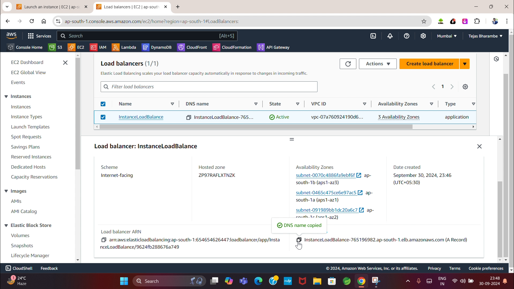
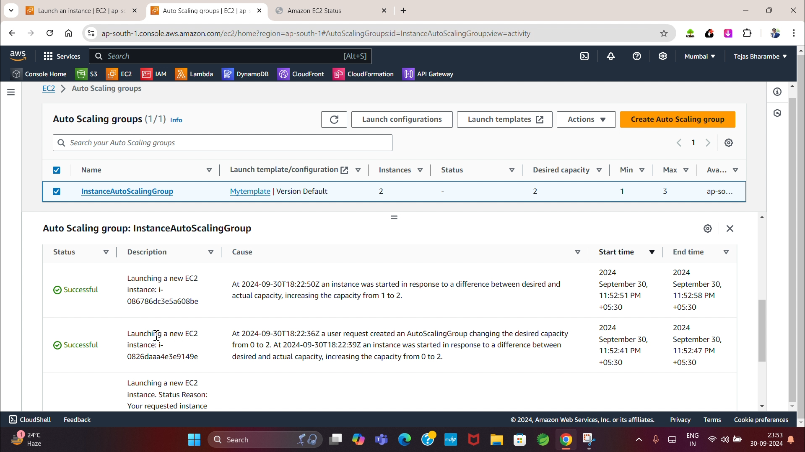
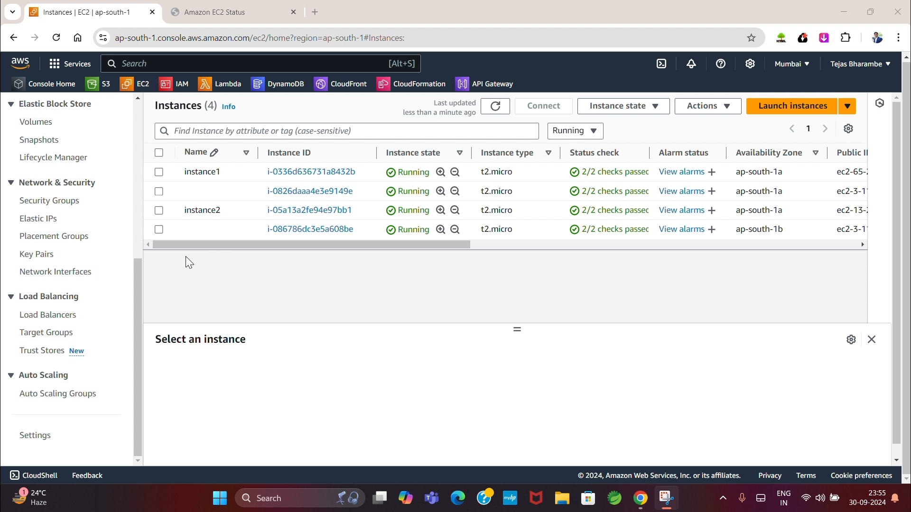
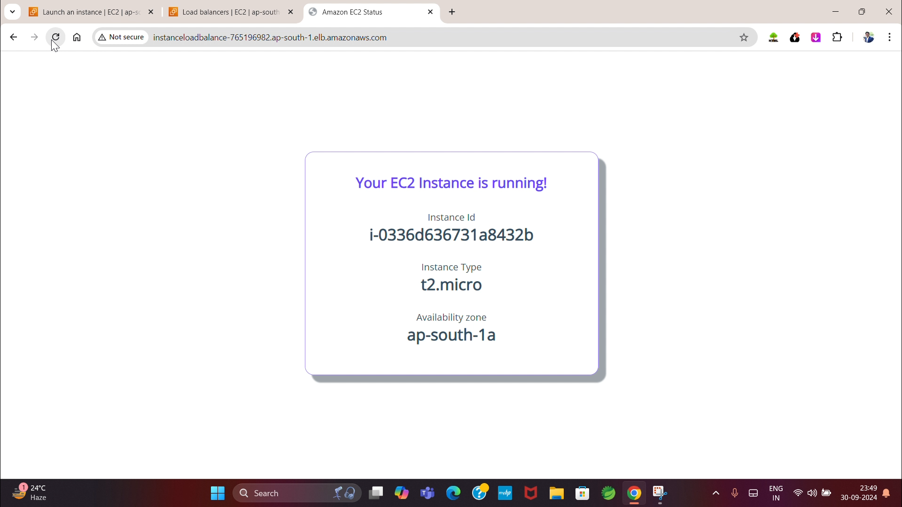

# BalancedFlow: Elastic Load Balancing and Auto Scaling for Scalable Web Services

BalancedFlow is a robust project designed to demonstrate the implementation of Elastic Load Balancing (ELB) and Auto Scaling on AWS to create a scalable and reliable web service architecture.

## Features

- **Elastic Load Balancer (ELB):**
  - Distributes traffic across multiple EC2 instances.
  - Ensures high availability and fault tolerance.
- **Auto Scaling:**
  - Automatically adjusts the number of EC2 instances based on traffic demands.
  - Maintains application performance and cost efficiency.

## Architecture

The architecture includes:

- EC2 instances distributed across multiple availability zones.
- An Application Load Balancer (ALB) to route HTTP traffic.
- Auto Scaling Groups to handle dynamic scaling.

## Architecture Diagram

## Setup Guide

### Prerequisites

- AWS Account
- AWS CLI installed and configured
- Basic understanding of EC2, VPC, and security groups

### Steps

#### 1. Launch EC2 Instances

- Launch multiple EC2 instances in your selected region and availability zones.

#### 2. Configure Elastic Load Balancer (ELB)

- Navigate to the EC2 Dashboard and create a new Application Load Balancer.
- Configure listeners, security groups, and target groups as follows:
  - Listener Protocol: HTTP
  - Port: 80
  - Health Check Path: `/`

#### 3. Set Up Auto Scaling

- Create an Auto Scaling Group associated with your ELB.
- Configure scaling policies:
  - Increase instances during high traffic.
  - Decrease instances during low traffic.

#### 4. Test Your Setup

- Access your application using the ELB DNS name.
- Simulate traffic to observe the scaling behavior.

#### 5. Cleanup

- To prevent unnecessary charges:

  1. Delete the Auto Scaling group in the EC2.

  2. Delete the launch Template in the EC2.

  3. Delete the Target Group in the EC2.

  4. Delete the Load Balancer in the EC2.

  5. Delete the Security Group in EC2.

## Output

## Outcomes

This project demonstrates:

- The capability of AWS ELB to handle traffic distribution.
- The effectiveness of Auto Scaling in maintaining optimal performance.
- High availability and fault tolerance for web applications.

## References

This project was inspired by the AWS tutorial:

- [Getting started with Application Load Balancers](https://docs.aws.amazon.com/elasticloadbalancing/latest/application/application-load-balancer-getting-started.html)

- [Create your first Auto Scaling group](https://docs.aws.amazon.com/autoscaling/ec2/userguide/create-your-first-auto-scaling-group.html)

- [Set up a scaled and load-balanced application](https://docs.aws.amazon.com/autoscaling/ec2/userguide/tutorial-ec2-auto-scaling-load-balancer.html).

## Author

**Tejas Bharambe**  
Full Stack Developer | AWS Enthusiast  
[GitHub](https://github.com/tejasb15) | [LinkedIn](https://www.linkedin.com/in/tejasb15/)
