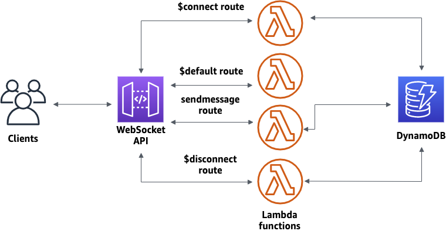

# Serverless Real-time Chat Application with Global Distribution

A **Serverless Real-time Chat Application** that allows users from all over the world to send and receive messages instantly without managing any servers. This project leverages AWS services for scalability, reliability, and global distribution.

---

## Features

- **Serverless:** AWS handles the infrastructure; focus only on the application logic.
- **Real-time Messaging:** Instant communication with WebSocket API.
- **Global Distribution:** Low-latency access from anywhere using Amazon CloudFront.

---

## Prerequisites

- **AWS Account**
- Basic knowledge of:
  - AWS Lambda
  - Amazon DynamoDB
  - API Gateway
- AWS CLI and SAM CLI installed (optional for CloudFormation setup)

---

## Architecture

The project integrates the following AWS components:

- **API Gateway (WebSocket):** Manages two-way client communication.
- **AWS Lambda:** Executes functions for client actions (e.g., connect, disconnect, send messages).
- **Amazon DynamoDB:** Stores client connections and chat messages.
- **Amazon S3:** Hosts static web application files.
- **Amazon CloudFront:** Ensures low-latency global delivery.

---

## Deployment Steps

### Step 1: Create Lambda Functions and DynamoDB Table

1. Download and unzip the [CloudFormation Template](https://docs.aws.amazon.com/apigateway/latest/developerguide/samples/ws-chat-app-starter.zip).
2. Deploy the template via AWS CloudFormation:
   - Navigate to **CloudFormation** in the AWS Console.
   - Create a new stack and upload the `.yaml` or `.json` template.
   - Name the stack (e.g., `serverless-chat`).
   - Acknowledge required IAM permissions and deploy.

---

### Step 2: Configure WebSocket API

1. Open the **API Gateway** console and create a WebSocket API.
2. Define routes:
   - `$connect` (handles new connections).
   - `$disconnect` (handles disconnections).
   - `$default` (handles unmatched routes).
   - Add a custom route `sendmessage` for sending chat messages.
3. Attach the Lambda functions to the respective routes:
   - `$connect` -> `serverless-chat-ConnectHandler`
   - `$disconnect` -> `serverless-chat-DisconnectHandler`
   - `sendmessage` -> `serverless-chat-SendMessageHandler`
4. Deploy the WebSocket API under the `production` stage.

---

### Step 3: Test the API

- Use the `wscat` command-line tool to test:
  1. Connect to the WebSocket URL (e.g., `wss://your-api-id.execute-api.region.amazonaws.com/production/`).
  2. Send a message: `{"action": "sendmessage", "message": "Hello, World!"}`
  3. Observe the message broadcast to all connected clients.

---

### Step 4: Cleanup

To prevent unnecessary charges:

1. Delete the WebSocket API in API Gateway.
2. Delete the CloudFormation stack to remove associated resources.

---

## Screenshots

---

## Credit

This project was inspired by the AWS tutorial: [Create a WebSocket chat app with a WebSocket API, Lambda, and DynamoDB](https://docs.aws.amazon.com/apigateway/latest/developerguide/websocket-api-chat-app.html).

---

## Author

- **Tejas Bharambe**
  - [GitHub](https://github.com/tejasb15)
  - [LinkedIn](https://www.linkedin.com/in/tejasb15/)
