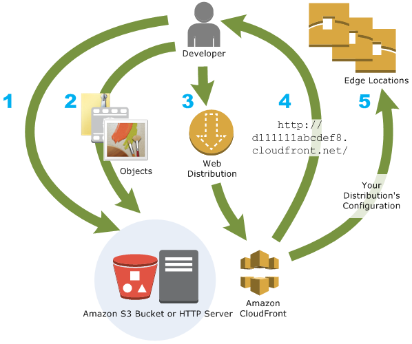
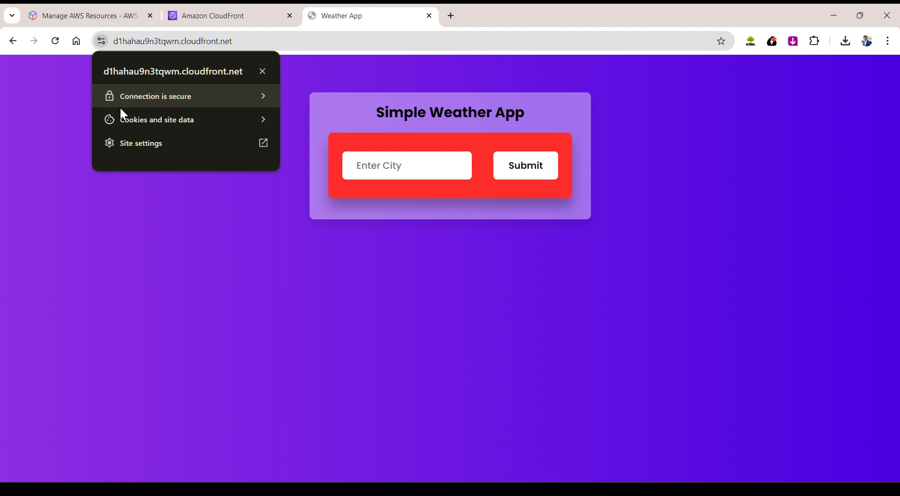
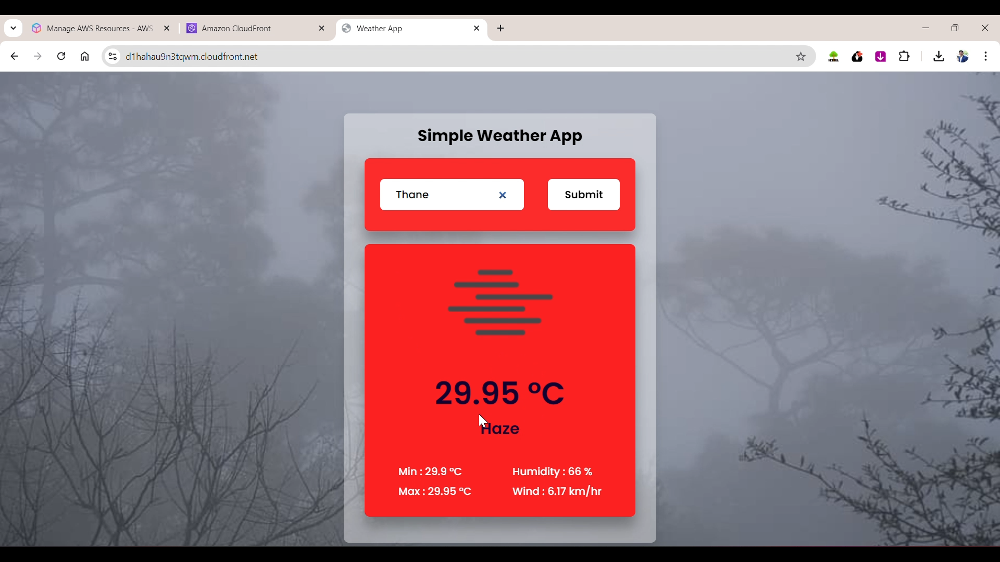

# Static Web Hosting using Amazon S3 and CloudFront 🌐

## Overview

This project demonstrates how to host a static website using **Amazon S3** and enhance its performance with **CloudFront**, AWS's Content Delivery Network (CDN). The goal is to provide a scalable, durable, and globally distributed solution for hosting static web content, like HTML, CSS, and JavaScript.

## Architecture Diagram

Below is the architecture of the static web hosting solution using Amazon S3 and CloudFront:

## Key Features

- **S3 Static Website Hosting**:
  - Store and host static web content with high durability and availability.
  - Cost-effective and easy-to-manage web hosting solution.
- **CloudFront Integration**:
  - Enhanced global content delivery with reduced latency.
  - Secure and scalable distribution using AWS's global infrastructure.

## Objectives

1. Deploy a static website with a public S3 bucket.
2. Use **CloudFront** to distribute content with low latency.
3. Enable SSL/TLS for secure content delivery.
4. Demonstrate cost-effective and scalable static hosting.

## Steps to Deploy

1. **Set Up Amazon S3**:

   - Create an S3 bucket.
   - Enable static website hosting.
   - Upload the weather app files (`index.html`, CSS, JS).

2. **Configure Permissions**:

   - Add a bucket policy for public access.
   - Verify access via the S3 website endpoint.

3. **Set Up Amazon CloudFront**:

   - Create a CloudFront distribution linked to the S3 bucket.
   - Configure HTTPS and caching for performance.

4. **Access the Website**:
   - Use the CloudFront domain for secure and accelerated content delivery.

## Architecture

- **Amazon S3**: Object storage for static content with public-read access.
- **Amazon CloudFront**: CDN for global delivery, caching, and performance improvement.
- **Website Endpoint**: Direct access through S3 and CloudFront domain.

## Example: Weather App Deployment

Below is an example of a Weather App deployed using **Amazon S3** and **CloudFront**:

- **S3 Website Endpoint**: `http://your-s3-bucket-name.s3-website-region.amazonaws.com`
- **CloudFront Domain**: `https://your-cloudfront-domain.cloudfront.net`

While this repository focuses on the **`How To Make This Website`**, you can see practical applications of this approach in:

- [Weather App Development](https://github.com/tejasb15/Weather-App.git)

## Limitations

- **No server-side processing**: Suitable only for static content.
- **Security configurations**: Requires careful bucket policies to avoid unauthorized access.
- **Custom error pages**: Limited compared to traditional web servers.

## Advantages

- **High Availability**: 99.999999999% (11 nines) durability.
- **Scalability**: Automatically handles increased traffic.
- **Low Latency**: Content cached closer to users through edge locations.
- **Cost-Effective**: Pay-as-you-go pricing.

## Testing the Website

- Access the website using the S3 endpoint.
- Test the CloudFront distribution domain for faster and secure content delivery.

## Future Enhancements

- Add **AWS Lambda@Edge** for dynamic content.
- Use **AWS Route 53** for custom domain integration.

## References

- [Amazon S3 Documentation](https://docs.aws.amazon.com/AmazonS3/latest/userguide/WebsiteHosting.html)
- [Amazon CloudFront Documentation](https://docs.aws.amazon.com/AmazonCloudFront/latest/DeveloperGuide/getting-started-secure-static-website-cloudformation-template.html)

## Author

**Tejas Bharambe**  
Full Stack Developer | AWS Enthusiast  
[GitHub](https://github.com/tejasb15) | [LinkedIn](https://www.linkedin.com/in/tejasb15/)
